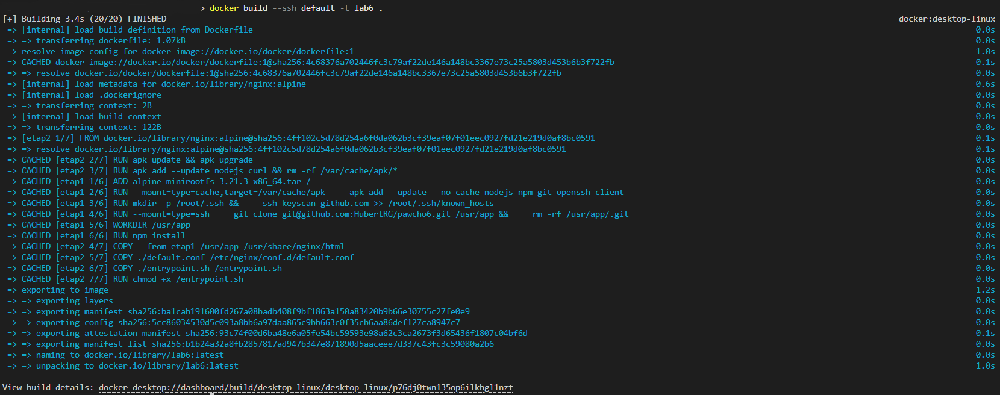
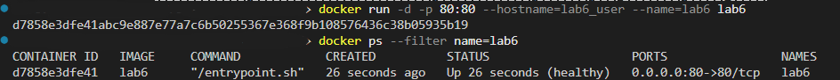
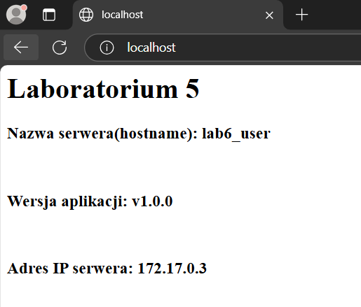
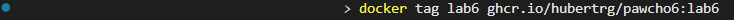
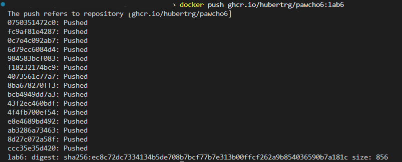
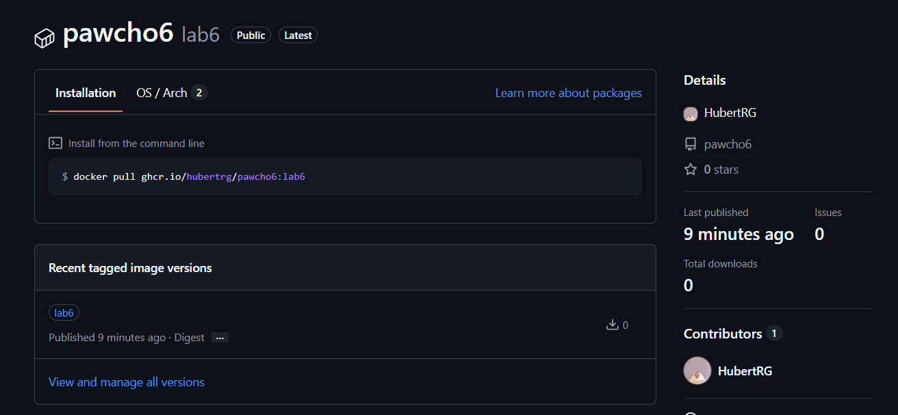

# Sprawozdanie Z Laboratorium 6

## Treść utworzonego Dockerfile:

```
#syntax=docker/dockerfile:1

FROM scratch AS etap1

ADD alpine-minirootfs-3.21.3-x86_64.tar /

RUN --mount=type=cache,target=/var/cache/apk \
    apk add --update --no-cache nodejs npm git openssh-client

RUN mkdir -p /root/.ssh && \
    ssh-keyscan github.com >> /root/.ssh/known_hosts

RUN --mount=type=ssh \
    git clone git@github.com:HubertRG/pawcho6.git /usr/app && \
    rm -rf /usr/app/.git

WORKDIR /usr/app

RUN npm install

FROM nginx:alpine AS etap2

RUN apk update && apk upgrade
RUN apk add --update nodejs curl && rm -rf /var/cache/apk/*

COPY --from=etap1 /usr/app /usr/share/nginx/html

COPY ./default.conf /etc/nginx/conf.d/default.conf

COPY ./entrypoint.sh /entrypoint.sh
RUN chmod +x /entrypoint.sh

HEALTHCHECK --interval=10s --timeout=1s --retries=3 \
    CMD curl -f http://localhost:80 || exit 1

ARG VERSION
ENV APP_VERSION=${VERSION:-v1.0.0}

LABEL org.opencontainers.image.source="https://github.com/HubertRG/pawcho6"

EXPOSE 80

ENTRYPOINT [ "/entrypoint.sh" ]
```

## Polecenie użyte do budowy obrazu:

```
docker build --ssh default -t lab6 .
```

## Wynik budowania obrazu:



## Polecenie uruchamiające serwer:

```
docker run -d -p 80:80 --hostname=lab6_user --name=lab6 lab6
```

## Polecenie potwierdzające działanie kontenera i poprawne funkcjonowanie opracowanej aplikacji:

```
docker ps --filter name=lab6
```



## Potwierdzenie, że aplikacja realizuje wymaganą funkcjonalność

### Uruchomienie przeglądarki oraz wpisanie adresu http://localhost:80/



## Nadanie obrazu odpowiedniego tag-u



## Przesłanie obrazu do swojego repozytorium



## Potwierdzenie obrazu widocznego na Githubie oraz powiązania z repozytorium



Powrót do początku: [<-](#sprawozdanie-z-laboratorium-6).
